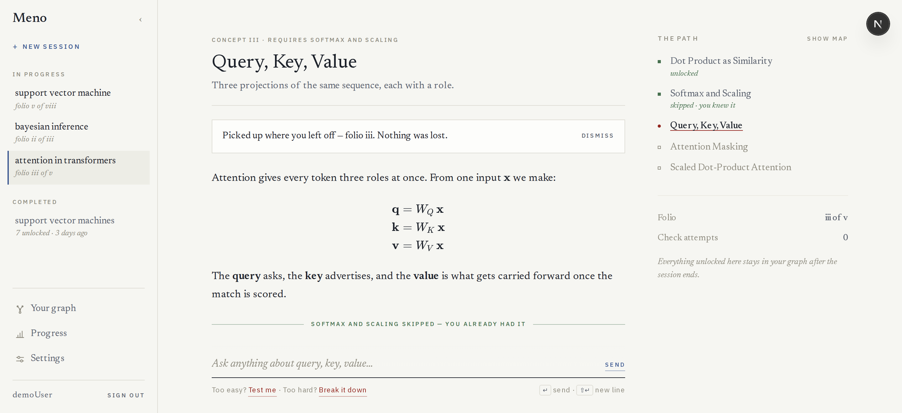
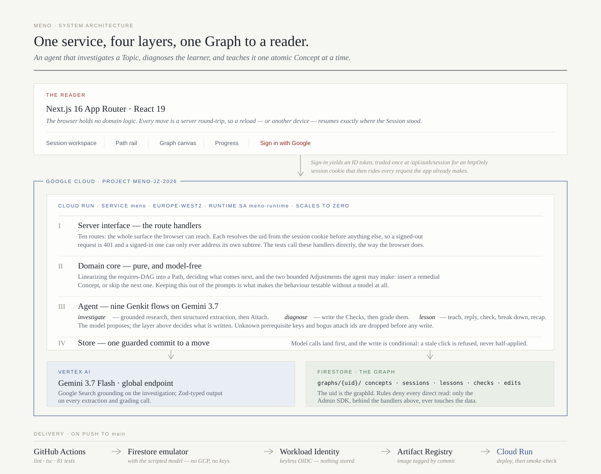

# Meno

A learning assistant that turns any topic into a personal, adaptive curriculum.

Give it a topic (or a concept you're stuck on), and the agent investigates it, figures out what you need to know first, asks you questions to find out where you actually are, then walks you through it one atomic concept at a time — quizzing you as it goes and adapting the path when you struggle or when you already know more than it assumed. Everything you unlock becomes a node in a personal knowledge graph you can inspect, correct, and grow over time.

Named after Plato's *Meno* — the dialogue built around the paradox of how you search for knowledge you don't yet have.

### **[→ Try it live](https://meno-965710783496.europe-west2.run.app)**

Running on Cloud Run in `europe-west2`. Sign in with Google; your graph is your own.
· **[Architecture](docs/architecture.md)** · **[Decision records](docs/adr/)**



*A session part-way along its path. The rail on the right is this session's ordering
of what is left to teach — and **Softmax and Scaling** is marked `skipped · you knew
it`, because the diagnostic found it was already there. Three levers sit under the
composer, laid out as the moves they are: **Previous concept** to re-read something
already passed, **Break it down** when a concept is too hard, and — rightmost, always
the way forward — **Test me** when it is too easy.*

## How it works

1. **Enter a topic** — a bare concept name or pasted text (e.g. an abstract).
2. **Investigate** — the agent researches the topic with Google Search grounding and identifies its prerequisites.
3. **Diagnose** — it asks you questions on the prerequisites and the topic itself to find your starting point.
4. **Preview the path** — it plans an ordered list of atomic concept nodes and shows you the whole journey upfront.
5. **Learn, one node at a time** — each node is taught and quizzed only when you reach it (lazy generation). Three levers sit under the composer, in the order they mean — back, down, on: **Previous concept** re-reads a lesson you have already passed (nothing moves; you come straight back), **Break it down** is for when it's too hard (the agent finds the prerequisite you're missing and teaches that first, as a short detour), and **Test me** is for when it's too easy (it skips the teaching, never the verification). Each node has one check; pass it and the rightmost lever becomes **Next concept**, and stays, so you leave when you're satisfied rather than the moment you're graded. Your answers can also trigger the agent to insert a remedial node, or — when a passing answer demonstrates the next node too — to skip that one; the graph reshapes live as this happens.
6. **Review the graph** — unlocked concepts form a node-link graph; each node links back to the session where you learned it. You can rename or delete nodes yourself; edits are recorded in an audit log that feeds back into future graph updates.

You sign in with Google; everything past that point belongs to your account. Sessions behave like conversations: several can be in progress at once, each resumable where you left off, and they all feed the one graph. A topic that rests on something you've already learned *attaches* to the concept you already have rather than duplicating it — and if you've already unlocked it, it's skipped rather than taught twice.

## Architecture

[](docs/architecture.md)

One Next.js app on one Cloud Run service, in four layers: route handlers (the
whole surface the browser can reach), a pure model-free domain core, the Genkit
agent flows, and Firestore. The model sits behind a single seam (`MENO_MODEL`),
which is why the test suite runs with no GCP credentials at all. Full write-up
in **[docs/architecture.md](docs/architecture.md)**.

## Stack

- **Next.js** (App Router, TypeScript) — UI and API routes
- **Genkit** (`@genkit-ai/vertexai`) — agent orchestration, Gemini 3.7, Google Search grounding
- **Firestore** — graph nodes/edges, sessions, audit log
- **Firebase Auth** — Google sign-in, exchanged for an httpOnly session cookie
- **Cloud Run** — deployment target

## Getting started

### Prerequisites

- Node.js 22+
- A GCP project with the Vertex AI API enabled and billing configured
- A Firebase project (can be the same GCP project) with Firestore enabled, and
  **Google** enabled under Authentication → Sign-in method (the only provider
  the landing page offers; one that is off fails with
  `auth/operation-not-allowed` when someone tries it)

### Setup

```bash
npm install
cp .env.local.example .env.local
# set GCP_PROJECT_ID to your project; keep GCP_LOCATION=global
# (gemini-3 models are served from the global Vertex endpoint)
# fill in the two NEXT_PUBLIC_FIREBASE_* values from Firebase console > Project settings
gcloud auth application-default login   # local Vertex AI + Firestore credentials
gcloud services enable aiplatform.googleapis.com firestore.googleapis.com \
  identitytoolkit.googleapis.com
```

**Sign-in needs a service account key locally.** Application Default
Credentials from `gcloud auth application-default login` are your *user*
account, and they are enough for Firestore and Vertex but not for signing in:
minting a session cookie is an authenticated call to the Identity Toolkit,
and Google rejects user credentials there. The two halves of sign-in have
different needs — `verifyIdToken` only fetches Google's public keys and
succeeds regardless — so a setup missing this fails on the cookie alone, with
everything either side of it working. Download a key for the
`firebase-adminsdk-…` service account (Firebase console → Project settings →
Service accounts → Generate new private key), store it outside the repo, and
point `GOOGLE_APPLICATION_CREDENTIALS` at it:

```bash
mkdir -p ~/.config/firebase && chmod 700 ~/.config/firebase
mv ~/Downloads/<project>-firebase-adminsdk-*.json ~/.config/firebase/admin.json
chmod 600 ~/.config/firebase/admin.json
# then in .env.local:
#   GOOGLE_APPLICATION_CREDENTIALS=/home/<you>/.config/firebase/admin.json
```

That key *is* the service account — treat it as a secret, never commit it, and
revoke it from IAM → Service accounts → Keys if it leaks. None of this applies
on Cloud Run, where the attached `meno-runtime` account is handed tokens by
the metadata server and no key file exists.

`localhost` is an authorized sign-in domain by default, so Google sign-in
works in development against the real Firebase project — only the data is
local. Firestore Security Rules deny everything (`firestore.rules`) because
nothing but the server's Admin SDK ever touches Firestore; deploy them with
`npx firebase deploy --only firestore:rules`.

### Run locally

Two modes:

```bash
npm run dev       # real Gemini + your project's real Firestore
npm run dev:emu   # real Gemini + local Firestore emulator (data persists in .emulator-data/)
```

Note that `.env.local` is gitignored, so a fresh **git worktree does not
inherit it** — copy it across before running there, or the browser gets an
empty `apiKey` and sign-in fails with `auth/invalid-api-key`.

Open http://localhost:3000. `dev:emu` is the safe dogfooding mode: Sessions live only on your machine and survive restarts, without touching production data.

### Seed the emulator

Working on the interface needs a Graph to look at, and building one through the app costs real model calls. With `dev:emu` running:

```bash
npm run seed              # a Graph covering every UI state
npm run seed -- --reset   # wipe it first
```

That gives you four Sessions (three in progress at different points, one complete), a remedial detour, both kinds of skip, Lessons with markdown and mathematics, a Check and an Edit — enough to exercise every screen without calling a model. It refuses to run unless it can reach an emulator, so it can never write to live Firestore.

It fills the Graph called `demoUser`. To see it you can sign in as that
reader without a Firebase Auth project at all — uncomment both `MENO_AUTH`
lines in `.env.local` and sign-in becomes one click with no popup and no
token verification (ADR-0005; the server refuses to start with it in
production). To seed the Graph behind your real account instead, pass the uid
shown on the Settings page:

```bash
npm run seed -- --graph <your-uid>
```

### Run the tests

```bash
npm test
```

### Adopting the pre-auth graph

Everything written before sign-in existed lives under the Graph id
`demoUser`, which no account can reach. Sign in first, read your uid off the
Settings page, then copy it across:

```bash
npm run adopt -- --to <your-uid>            # dry run: prints what would move
npm run adopt -- --to <your-uid> --apply    # writes it
```

It copies Concepts, Sessions, Lessons, Checks and Edits verbatim, leaves the
source Graph untouched, and refuses a target that already holds a Graph
(a typo'd uid is the usual reason) unless you pass `--merge`. Add
`FIRESTORE_EMULATOR_HOST=127.0.0.1:8792` to run it against your emulator.

### Migrating an existing graph

The schema changed when Path state moved off the Concept and onto the
Session (ADR-0004). The app reads graphs written before that change, but to
rewrite them for good:

```bash
npm run migrate                 # dry run: prints what would change
npm run migrate -- --apply      # writes it

# against the emulator instead of your real Firestore:
FIRESTORE_EMULATOR_HOST=127.0.0.1:8792 npm run migrate
```

It reads `.env.local` for `GCP_PROJECT_ID` and credentials, names the target
it is about to touch (live Firestore or the emulator) before doing anything,
and refuses to run rather than guess a project id. It is idempotent: a graph
already in the new shape is left alone.

Tests are black-box: they call the server interface (route handlers) the way the browser would, running against the **Firestore emulator** (needs Java 21+; started automatically) with a **scripted fake model** substituted at the model-injection seam (`MENO_MODEL=scripted`), so no GCP credentials or network are needed. Identity has the matching seam (`MENO_AUTH=scripted`): a test signs in by naming a uid in the session cookie, which is how `tests/auth.test.ts` gets two users and checks that neither can see the other's Graph.

### Deploy to Cloud Run

**Preview deploys:** every pull request from a branch of this repository gets its own Cloud Run service, `meno-pr-<number>`, built from that branch and deployed once the tests pass. A comment on the PR carries the URL and is edited in place on each push. A preview reads and writes the **same Firestore as production** — it is for trying the interface, not for isolated data — and it is deleted when the PR closes, along with its images (`.github/workflows/preview-cleanup.yml`). For the ones that workflow never got — previews from before it existed, a teardown that failed — `npm run previews` lists the orphans and `npm run previews -- --apply` deletes them; it only ever touches services both labelled `meno-preview` and named `meno-pr-<number>`, so production is out of its reach. Pull requests from forks are never deployed: a preview builds and runs the PR's own code with the deployer's credentials. Each preview is a new hostname, and Firebase Auth refuses sign-in popups from a domain it does not know, so the workflow adds the host to the project's authorized domains and removes it again on teardown; where it lacks the permission to do that it says so, and email-and-password sign-in works regardless.

**CI/CD (how deploys actually happen):** every push to `main` runs `.github/workflows/deploy.yml` — lint + the emulator test suite, then (via Workload Identity Federation, no stored keys) builds the Docker image, pushes it to Artifact Registry, and deploys to Cloud Run as the `meno-runtime` service account. Configuration comes from GitHub repo variables: `GCP_PROJECT_ID`, `GCP_REGION`, `GCP_WIF_PROVIDER`, `GCP_DEPLOYER_SA`, `GCP_RUNTIME_SA`, plus `NEXT_PUBLIC_FIREBASE_API_KEY` and `NEXT_PUBLIC_FIREBASE_AUTH_DOMAIN` (passed as Docker **build args** — `NEXT_PUBLIC_*` is inlined into the client bundle at build time, so setting them at runtime does nothing). Left unset they do not fail the build: they inline as `""` and ship a page that cannot sign anybody in, while the deploy stays green and the smoke check passes because it asks a server route that never reads them. The Dockerfile refuses to build without them for exactly that reason.

**Manual deploy** (equivalent, for a machine with `gcloud`):

One-time: create the runtime service account and grant it the three roles the app needs.

```bash
gcloud iam service-accounts create meno-runtime \
  --display-name="Meno Cloud Run runtime" --project=<your-project-id>

gcloud projects add-iam-policy-binding <your-project-id> \
  --member="serviceAccount:meno-runtime@<your-project-id>.iam.gserviceaccount.com" \
  --role="roles/aiplatform.user"

gcloud projects add-iam-policy-binding <your-project-id> \
  --member="serviceAccount:meno-runtime@<your-project-id>.iam.gserviceaccount.com" \
  --role="roles/datastore.user"

# Minting session cookies calls the Identity Toolkit as this account.
gcloud projects add-iam-policy-binding <your-project-id> \
  --member="serviceAccount:meno-runtime@<your-project-id>.iam.gserviceaccount.com" \
  --role="roles/firebaseauth.admin"
```

Then build, push and deploy. `gcloud run deploy --source` is no longer
enough on its own: it gives the build no way to pass the Firebase web config,
and `NEXT_PUBLIC_*` has to be present when `npm run build` runs, so the image
is built explicitly instead (note `GCP_LOCATION=global` — gemini-3 models
are only served from the global Vertex endpoint; the Cloud Run region is
independent of it):

```bash
IMAGE=us-central1-docker.pkg.dev/<your-project-id>/meno/meno:$(git rev-parse --short HEAD)

docker build -t "$IMAGE" \
  --build-arg NEXT_PUBLIC_FIREBASE_API_KEY=<key> \
  --build-arg NEXT_PUBLIC_FIREBASE_AUTH_DOMAIN=<your-project-id>.firebaseapp.com \
  .
docker push "$IMAGE"

gcloud run deploy meno \
  --image "$IMAGE" \
  --region us-central1 \
  --allow-unauthenticated \
  --service-account meno-runtime@<your-project-id>.iam.gserviceaccount.com \
  --set-env-vars GCP_PROJECT_ID=<your-project-id>,GCP_LOCATION=global
```

Finally, add the Cloud Run URL to Firebase console → Authentication →
Settings → Authorized domains, or the sign-in popup is rejected on the
deployed site. The API key is a public identifier rather than a credential,
but restrict it to the Identity Toolkit API under Google Cloud console → APIs
& Services → Credentials so it cannot be used against your other APIs.

## Status

Early build — in progress. Current scope is Google sign-in with one graph per account, text-only topic input (file upload planned), and a bounded adaptive path (insert-remedial / skip-next). Concepts found by different sessions are already reconciled as they are created — that is what *attaching* is — but the manual half is missing: merging two concepts you decide are the same, and drawing a prerequisite edge the agent didn't find. That, and a dedicated LLM-analysis layer over the edit audit log, are explicit future work.
